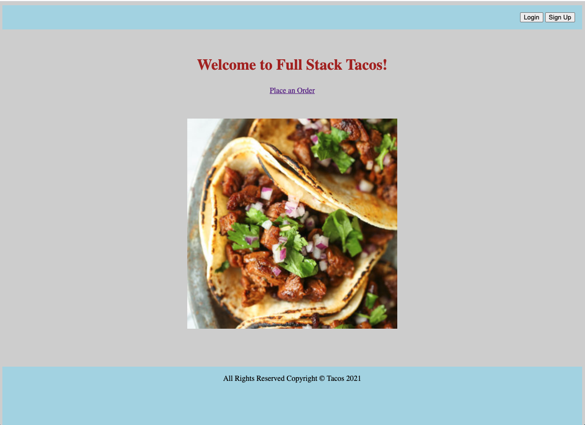
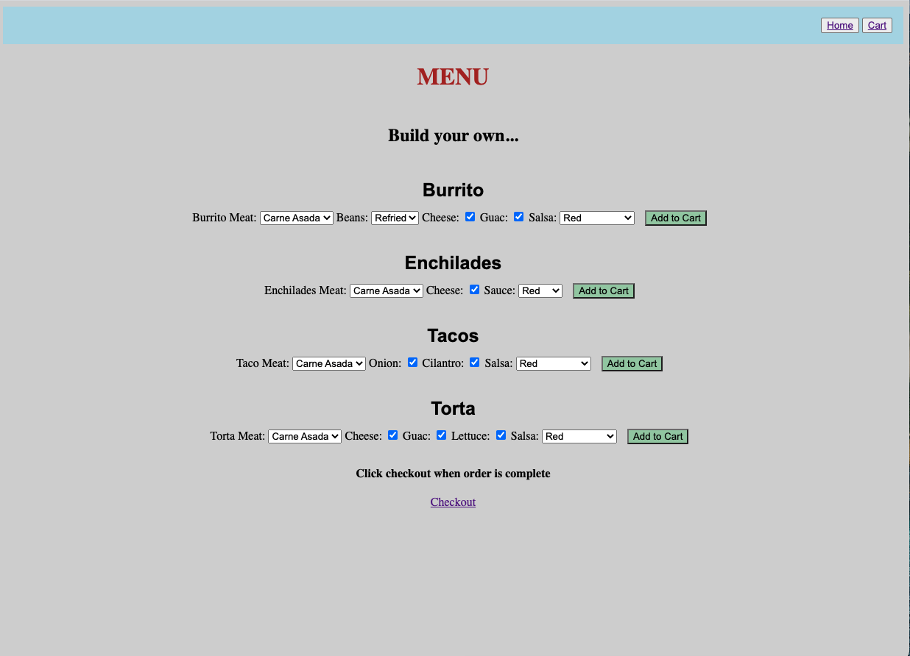
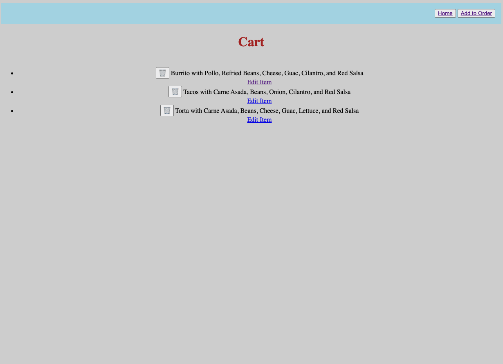
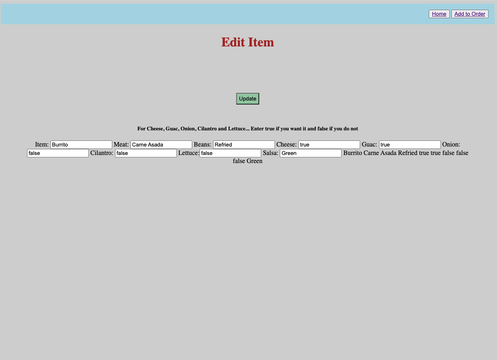

# Full Stack Tacos

I have built an App for a fictiious local taco truck where you can customize your order ahead of time

## Technologies Used
- HTML5
- CSS3
- JavaScript
- Express
- Mongoose
- MongoDB

## Screenshots

## Getting Started
[Click here](https://taco-truck-app.herokuapp.com/) to get started

## Future Enhancements
- A greater selection of Taco Trucks that lead to where you can order
- More options in the Header
- Links to real taco trucks in your area where you can order
